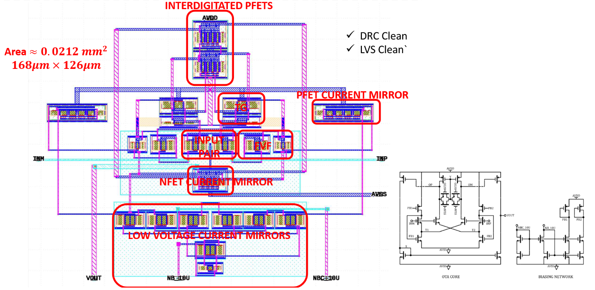

# FVF Based OTA using Open Source Tools / Automated using Python
SPDX-License-Identifier: Apache-2.0 <br>
|Name|Affiliation|IEEE Member|SSCS Member|
|:--:|:----------:|:----------:|:----------:|
|Subham Pal|National Institute of Technology(NIT) Durgapur, India|No|No|
|Ekadanta Soedarmadji|West Los Angeles College|No|No|
|Shubham Kumar|Texas Instruments, India <br> Indian Institute of Technology(IIT) Kharagpur, India|No|No|

## Please go through `/fvf_based_ota.pynb` file for details (Easily Opens in Colab :))
### Feel free to go through `./PPT_FVF_OTA.pdf` and this README

### The FVF based OTA schematic


### Layout of the FVF based OTA (Automated using Python)


### Post Layout PVT simulations for the OTA (Generated using CACE)
# CACE Summary for Post Layout Simulations

|      Parameter       |         Tool         |     Result      | Min Limit  |  Min Value   | Typ Target |  Typ Value   | Max Limit  |  Max Value   |  Status  |
| :------------------- | :------------------- | :-------------- | ---------: | -----------: | ---------: | -----------: | ---------: | -----------: | :------: |
| DC gain              | ngspice              | A0                   |             any |  40.469 dB |          any |  46.984 dB |          any |  59.084 dB |   Pass ✅    |
| Unity Gain Frequency | ngspice              | UGF                  |             any | 436845.000 Hz |          any | 1007410.000 Hz |          any | 4433840.000 Hz |   Pass ✅    |
| Phase Margin         | ngspice              | PM                   |             any |   76.171 ° |          any |   88.659 ° |          any |   90.022 ° |   Pass ✅    |
| DC CMRR              | ngspice              | CMRR_DC              |             any | -75.288 dB |          any | -54.392 dB |          any | -40.354 dB |   Pass ✅    |
| DC PSRR              | ngspice              | PSRR_DC              |             any | -72.218 dB |          any | -51.392 dB |          any | -47.730 dB |   Pass ✅    |
| HD2 at 0.8V(p-p), 1kHz | ngspice              | HD2                  |             any |  33.533 dB |          any |  49.020 dB |          any |  68.631 dB |   Pass ✅    |
| HD3 at 0.8V(p-p), 1kHz | ngspice              | HD3                  |             any |  39.391 dB |          any |  55.518 dB |          any |  74.751 dB |   Pass ✅    |
| Noise:Vin(rms) (1kHz to 1MHz) | ngspice              | vin_noi_rms          |             any | 45.888 uVrms |          any | 56.984 uVrms |          any | 78.563 uVrms |   Pass ✅    |
| Rise Slew Rate       | ngspice              | rise_slew            |             any | 3.494 V/us |          any | 5.030 V/us |          any | 8.066 V/us |   Pass ✅    |
| Fall Slew Rate       | ngspice              | fall_slew            |             any | 2.195 V/us |          any | 3.368 V/us |          any | 5.424 V/us |   Pass ✅    |
| Total Static Power   | ngspice              | power_tot            |             any | 169.622 uW |          any | 183.604 uW |          any | 198.993 uW |   Pass ✅    |

## Pcells Created
The whole design can be broken into following p-cells:
1. Input Pair
2. **FVF cell**
3. **Low Voltage Current Mirror**
4. Current Mirror (Simple)
5. **Transmission Gate**
6. Interdigitated Cells

The above highlighted cells are designed from scratch and others are re-used from the existing repository.
This is followed by **Placement & Routing** automated using Python.

## Parameterized Pcell Developed
### FVF cell
```
def  flipped_voltage_follower(
        pdk: MappedPDK,
        device_type: str = "nmos",
        placement: str = "horizontal",
        width: tuple[float,float] = (3,3),
        length: tuple[float,float] = (None,None),
        fingers: tuple[int,int] = (1,1),
        multipliers: tuple[int,int] = (1,1),
        dummy_1: tuple[bool,bool] = (True,True),
        dummy_2: tuple[bool,bool] = (True,True),
        tie_layers1: tuple[str,str] = ("met2","met1"),
        tie_layers2: tuple[str,str] = ("met2","met1"),
        sd_rmult: int=1,
        **kwargs
        ) -> Component:
    """
    creates a Flipped Voltage Follower
    pdk: pdk to use
    device_type: either "nmos" or "pmos"
    placement: either "horizontal" or "vertical"
    width: (input fet, feedback fet)
    length: (input fet, feedback fet)
    fingers: (input fet, feedback fet)
    multipliers: (input fet, feedback fet)
    dummy_1: dummy for input fet
    dummy_2: dummy for feedback fet
    dnwell: adds Deep N-well
    sb_short: shorts the source and bulk of input fet if True
    tie_layers1: tie layers for input fet
    tie_layers2: tie layers for feedback fet
    sd_rmult: sd_rmult for both fets
    **kwargs: any kwarg that is supported by nmos and pmos
    NB:- currently LVS is passed only for nmos without sd_short and pmos with sd_short
    """
```
### Transmission Gate
```
def  transmission_gate(
        pdk: MappedPDK,
        width: tuple[float,float] = (1,1),
        length: tuple[float,float] = (None,None),
        fingers: tuple[int,int] = (1,1),
        multipliers: tuple[int,int] = (1,1),
        substrate_tap: bool = False,
        tie_layers: tuple[str,str] = ("met2","met1"),
        **kwargs
        ) -> Component:
    """
    creates a transmission gate
    tuples are in (NMOS,PMOS) order
    **kwargs are any kwarg that is supportef by nmos and pmos
    """
```
### Low Voltage Current Mirror (Not fully generic)
```
def  low_voltage_cmirror(
        pdk: MappedPDK,
        width:  tuple[float,float] = (4.15,1.42),
        length: float = 2,
        fingers: tuple[int,int] = (2,1),
        multipliers: tuple[int,int] = (1,1),
        ) -> Component:
    """
    A low voltage N type current mirror
    """
```
### LVS, DRC Clean Layout

