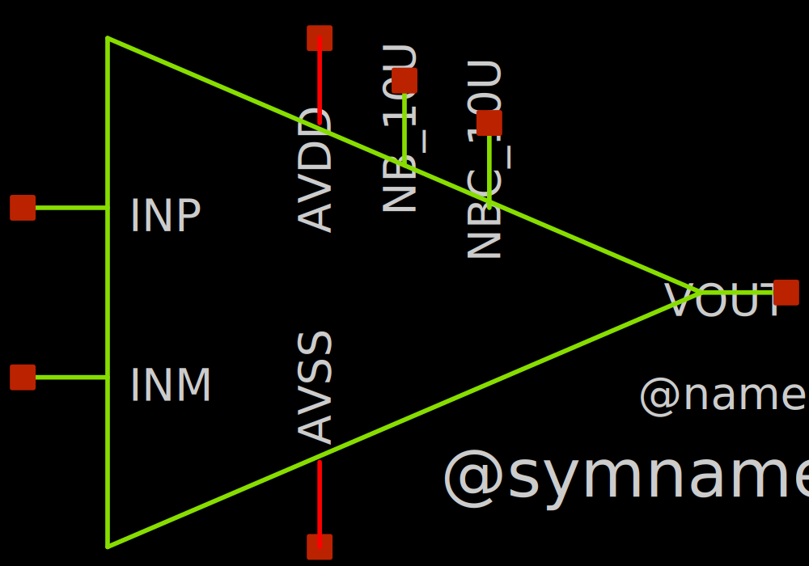
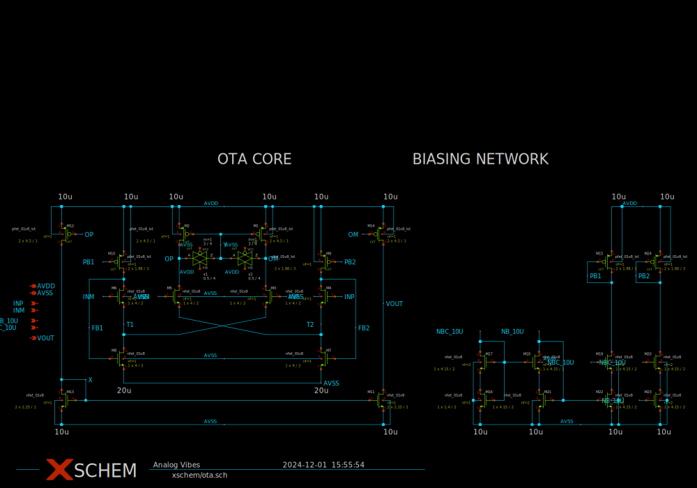

# ota

- Description: A FVF Based OTA
- PDK: sky130A

## Authorship

- Designer: Analog Vibes
- Company: Analog Vibes
- Created: Nov 23, 2024
- License: Apache 2.0
- Last modified: None

## Pins

## Default Conditions

- AVDD
  + Description: Analog power supply voltage
  + Display: Vdd
  + Unit: V
  + Typical: 1.8
- IPCM
  + Description: Input common mode voltage
  + Display: Vcm
  + Unit: V
  + Typical: 1.2
- IB
  + Description: Bias current
  + Display: Ib
  + Unit: uA
  + Typical: 10
- C_LOAD
  + Description: Output load capacitance
  + Display: CLoad
  + Unit: pF
  + Maximum: 80
- corner
  + Description: Process corner
  + Display: Corner
  + Typical: tt
- temperature
  + Description: Ambient temperature
  + Display: Temp
  + Unit: °C
  + Typical: 27

## Symbol

## Schematic

