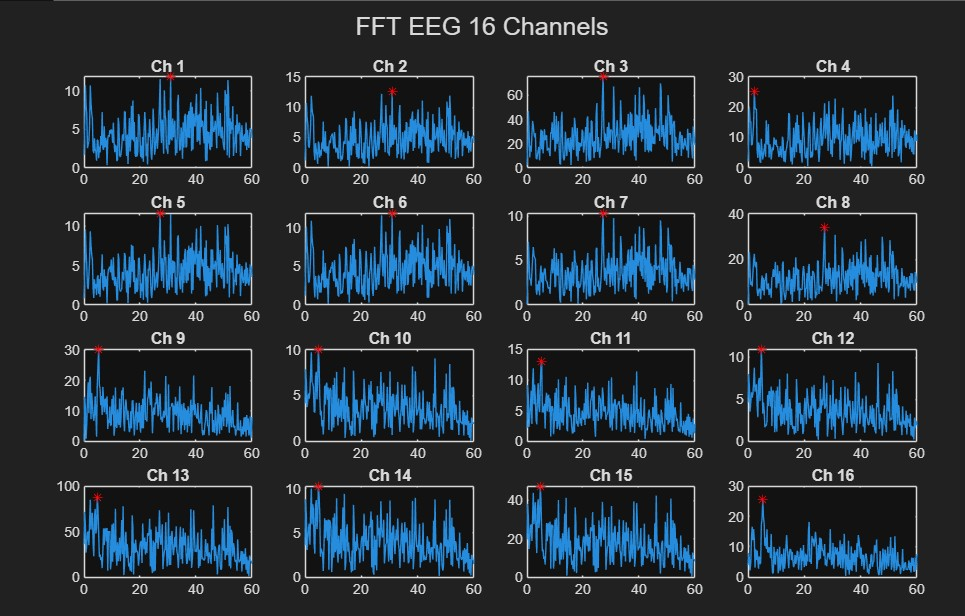
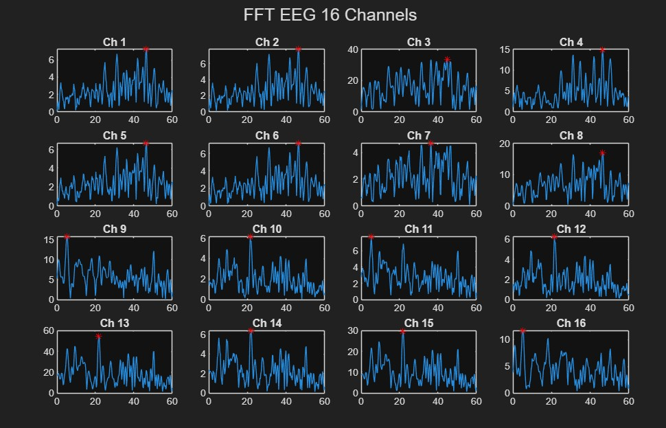
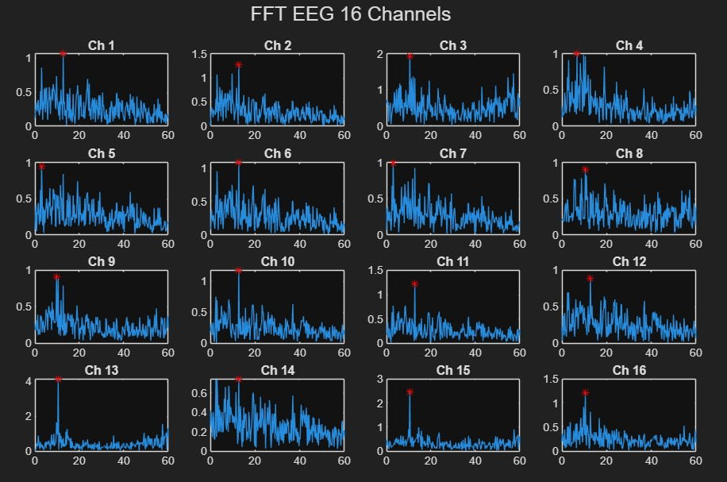
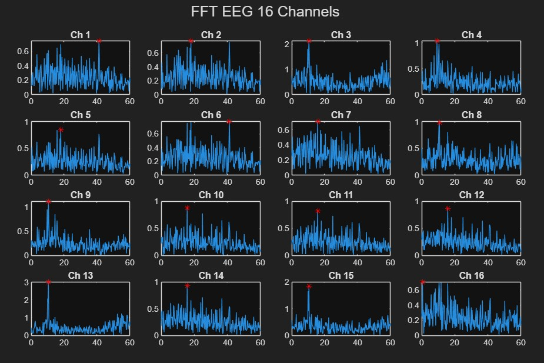
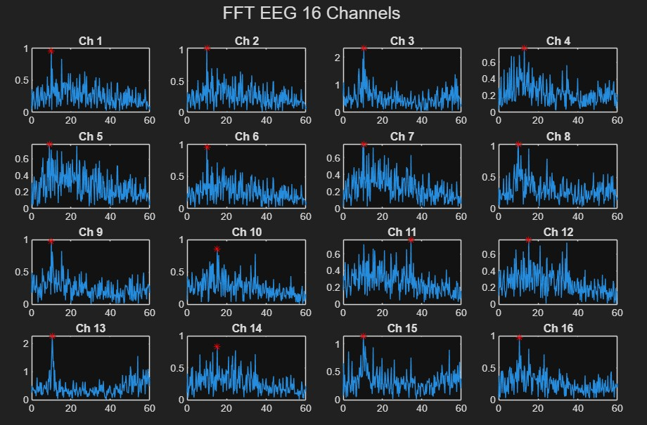
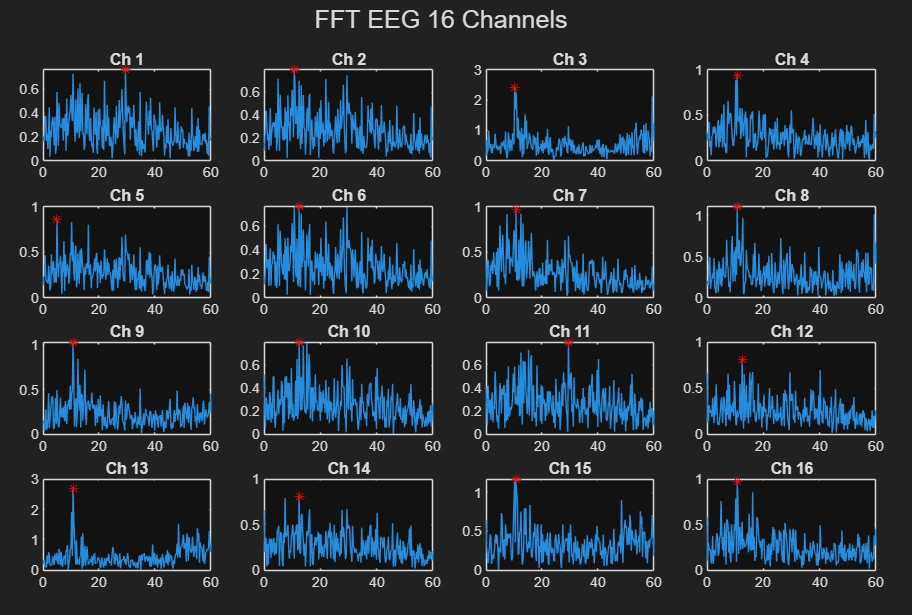

# Dummy EEG Signal
## Characteristic Result From FFT using Matlab

| **Activity**                     | **Frequency Range (Hz)** | **Amplitude Range (μV)** |
|-----------------------------|--------------------------|------------------------|
| Baseline Eyes Open          | 2.25 – 30.94    | 20.03 – 174.53            |
| Closing Left Hand       | 2.99 – 12.72     | 1.49 – 8.29               | 
| Closing Right Hand        | 4.99 – 46.41     | 9.41 – 108.74               | 
| Dorsal flexion of Left Foot        | 0.50 – 41.17                    | 1.41 – 6.02              | 
| Plantar flexion of Left Foot        | 4.99 – 29.44                     | 1.52 – 5.40               |                 
| Dorsal flexion of Right Foot             | 8.98 – 34.43                    | 1.52 – 4.67              |                 
| Plantar flexion of Right Foot            | 7.98 – 13.97                    | 1.66 – 3.92              |      
| Resting in Between Tasks          | 0.00 – 40.67                    | 9.86 – 124.15            |      

Dataset DOI: 10.17632/x8psbz3f6x.2

## About Subject - S1

**Basic Information**
- *Nationality:* Ecuadorian  
- *Date of Birth:* May 8, 1998  
- *Sex:* Male  
- *Right-handed:* Yes  
- *Weight:* 70 kg  
- *Height:* 1.75 m  
- *Level of Education:* Undergraduate  

**Lifestyle Habits**
- *Energy Drinks:* Almost never  
- *Alcoholic Drinks:* Never  
- *Smoke:* Never  
- *Sports Activity:* Infrequent  

**Medical History**
- *Under Medical Treatment:* No  
- *Limb Loss:* No  
- *Neurological Disorder:* No  
- *COVID-19 History:* No  

## FFT code

<pre>
  
data = csvread('S1R1I3_1.csv',0,1);
fs = 125;
t = (0:size(data,1)-1)/fs;
N = size(data,1);
f = (0:N-1)*(fs/N);
mid = floor(N/2);
f_half = f(1:mid);

figure;
for ch = 1:16
    x = data(:,ch);
    X = fft(x);
    mag = abs(X)/N;
    mag_half = mag(1:mid);
    [peak_val, peak_idx] = max(mag_half);
    peak_freq = f_half(peak_idx);
    amplitude = 2 * mag_half(peak_idx);
    fprintf('Ch %d | Peak Frequency = %.2f Hz | Amplitude ≈ %.2f μV\n', ...
        ch, peak_freq, amplitude);

    subplot(4,4,ch)
    plot(f_half, mag_half)
    title(['Ch ', num2str(ch)])
    xlim([0 60])
    hold on
    plot(peak_freq, peak_val, 'r*')
    hold off
end
sgtitle('FFT EEG 16 Channels')

</pre>

## Simulation

  

<h4 align="center" style="font-size:16px;">Figure 1. Subject 1 Baseline Eyes Open FFT</h4>

| Channel | Peak Frequency (Hz) | Amplitude (μV) |
|---------|---------------------|----------------|
| Ch 1    | 30.94               | 23.61          |
| Ch 2    | 30.94               | 25.22          |
| Ch 3    | 27.20               | 150.92         |
| Ch 4    | 2.25                | 50.22          |
| Ch 5    | 27.20               | 23.28          |
| Ch 6    | 30.94               | 23.72          |
| Ch 7    | 27.20               | 20.60          |
| Ch 8    | 27.20               | 68.18          |
| Ch 9    | 5.24                | 60.42          |
| Ch 10   | 4.74                | 20.03          |
| Ch 11   | 5.24                | 26.08          |
| Ch 12   | 4.74                | 21.82          |
| Ch 13   | 4.74                | 174.53         |
| Ch 14   | 4.74                | 20.56          |
| Ch 15   | 4.74                | 94.86          |
| Ch 16   | 5.24                | 51.10          |

  

<h4 align="center" style="font-size:16px;">Figure 2. Subject 1 Closing Left Hand FFT</h4>

| Channel | Peak Frequency (Hz) | Amplitude (μV) |
|---------|---------------------|----------------|
| Ch 1    | 12.72               | 2.13           |
| Ch 2    | 12.72               | 2.54           |
| Ch 3    | 10.48               | 3.90           |
| Ch 4    | 6.74                | 2.00           |
| Ch 5    | 2.99                | 1.90           |
| Ch 6    | 12.72               | 2.17           |
| Ch 7    | 2.99                | 1.98           |
| Ch 8    | 10.48               | 1.80           |
| Ch 9    | 9.73                | 1.83           |
| Ch 10   | 12.72               | 2.35           |
| Ch 11   | 12.72               | 2.45           |
| Ch 12   | 12.72               | 1.79           |
| Ch 13   | 10.48               | 8.29           |
| Ch 14   | 12.72               | 1.49           |
| Ch 15   | 10.48               | 4.92           |
| Ch 16   | 10.48               | 2.43           |

  

<h4 align="center" style="font-size:16px;">Figure 3. Subject 1 Closing Right Hand FFT</h4>

| Channel | Peak Frequency (Hz) | Amplitude (μV) |
|---------|---------------------|----------------|
| Ch 1    | 46.41               | 14.46          |
| Ch 2    | 46.41               | 15.57          |
| Ch 3    | 44.66               | 67.21          |
| Ch 4    | 46.41               | 29.77          |
| Ch 5    | 46.41               | 13.31          |
| Ch 6    | 46.41               | 14.37          |
| Ch 7    | 36.18               | 9.41           |
| Ch 8    | 46.41               | 34.06          |
| Ch 9    | 5.24                | 31.47          |
| Ch 10   | 21.46               | 12.28          |
| Ch 11   | 5.24                | 15.50          |
| Ch 12   | 21.46               | 12.54          |
| Ch 13   | 21.71               | 108.74         |
| Ch 14   | 21.96               | 12.75          |
| Ch 15   | 21.71               | 59.01          |
| Ch 16   | 4.99                | 23.33          |

  

<h4 align="center" style="font-size:16px;">Figure 4. Subject 1 Dorsal flexion of Left Foot FFT</h4>

| Channel | Peak Frequency (Hz) | Amplitude (μV) |
|---------|---------------------|----------------|
| Ch 1    | 41.17               | 1.48           |
| Ch 2    | 17.96               | 1.54           |
| Ch 3    | 10.48               | 4.24           |
| Ch 4    | 9.23                | 2.07           |
| Ch 5    | 17.96               | 1.69           |
| Ch 6    | 41.17               | 1.55           |
| Ch 7    | 15.72               | 1.42           |
| Ch 8    | 10.73               | 1.97           |
| Ch 9    | 10.48               | 2.22           |
| Ch 10   | 15.72               | 1.77           |
| Ch 11   | 15.72               | 1.66           |
| Ch 12   | 15.72               | 1.74           |
| Ch 13   | 10.48               | 6.02           |
| Ch 14   | 15.72               | 1.86           |
| Ch 15   | 10.48               | 3.68           |
| Ch 16   | 0.50                | 1.41           |

  

<h4 align="center" style="font-size:16px;">Figure 5. Subject 1 Dorsal flexion of Right Foot FFT</h4>

| Channel | Peak Frequency (Hz) | Amplitude (μV) |
|---------|---------------------|----------------|
| Ch 1    | 9.98                | 1.92           |
| Ch 2    | 9.98                | 2.05           |
| Ch 3    | 10.48               | 4.67           |
| Ch 4    | 12.97               | 1.53           |
| Ch 5    | 8.98                | 1.55           |
| Ch 6    | 9.98                | 1.90           |
| Ch 7    | 10.48               | 1.52           |
| Ch 8    | 9.98                | 2.05           |
| Ch 9    | 9.98                | 1.95           |
| Ch 10   | 15.22               | 1.72           |
| Ch 11   | 34.43               | 1.54           |
| Ch 12   | 15.22               | 1.54           |
| Ch 13   | 10.48               | 4.54           |
| Ch 14   | 15.22               | 1.67           |
| Ch 15   | 10.23               | 2.29           |
| Ch 16   | 10.48               | 1.96           |

  

<h4 align="center" style="font-size:16px;">Figure 6. Subject 1 Plantar flexion of Left Foot FFT</h4>

| Channel | Peak Frequency (Hz) | Amplitude (μV) |
|---------|---------------------|----------------|
| Ch 1    | 29.44               | 1.52           |
| Ch 2    | 10.73               | 1.59           |
| Ch 3    | 10.23               | 4.83           |
| Ch 4    | 10.73               | 1.87           |
| Ch 5    | 4.99                | 1.72           |
| Ch 6    | 12.48               | 1.53           |
| Ch 7    | 10.73               | 1.93           |
| Ch 8    | 10.73               | 2.22           |
| Ch 9    | 10.73               | 2.05           |
| Ch 10   | 12.48               | 1.60           |
| Ch 11   | 29.44               | 1.59           |
| Ch 12   | 12.48               | 1.62           |
| Ch 13   | 10.73               | 5.40           |
| Ch 14   | 12.48               | 1.63           |
| Ch 15   | 10.73               | 2.35           |
| Ch 16   | 10.73               | 1.94           |

  

<h4 align="center" style="font-size:16px;">Figure 7. Subject 1 Plantar flexion of Right Foot FFT</h4>

| Channel | Peak Frequency (Hz) | Amplitude (μV) |
|---------|---------------------|----------------|
| Ch 1    | 10.98               | 1.88           |
| Ch 2    | 10.73               | 2.20           |
| Ch 3    | 10.73               | 4.95           |
| Ch 4    | 10.48               | 2.48           |
| Ch 5    | 11.73               | 1.70           |
| Ch 6    | 10.73               | 2.16           |
| Ch 7    | 13.97               | 1.66           |
| Ch 8    | 10.48               | 2.30           |
| Ch 9    | 10.73               | 2.72           |
| Ch 10   | 11.23               | 1.86           |
| Ch 11   | 11.23               | 1.78           |
| Ch 12   | 7.98                | 1.79           |
| Ch 13   | 10.48               | 5.58           |
| Ch 14   | 11.98               | 1.69           |
| Ch 15   | 10.48               | 2.91           |
| Ch 16   | 10.98               | 1.80           |

  

<h4 align="center" style="font-size:16px;">Figure 8. Subject 1 Rest FFT</h4>

| Channel | Peak Frequency (Hz) | Amplitude (μV) |
|---------|---------------------|----------------|
| Ch 1    | 40.67               | 13.10          |
| Ch 2    | 40.67               | 13.97          |
| Ch 3    | 32.44               | 71.47          |
| Ch 4    | 40.67               | 25.32          |
| Ch 5    | 40.67               | 11.91          |
| Ch 6    | 40.67               | 13.09          |
| Ch 7    | 32.44               | 9.86           |
| Ch 8    | 32.44               | 32.06          |
| Ch 9    | 25.20               | 45.32          |
| Ch 10   | 23.20               | 12.80          |
| Ch 11   | 25.20               | 20.36          |
| Ch 12   | 0.00                | 14.10          |
| Ch 13   | 23.20               | 124.15         |
| Ch 14   | 8.73                | 14.97          |
| Ch 15   | 23.20               | 66.40          |
| Ch 16   | 25.20               | 33.93          |

