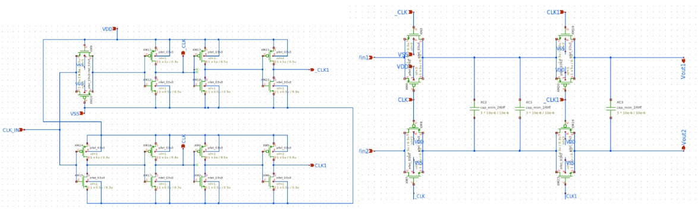
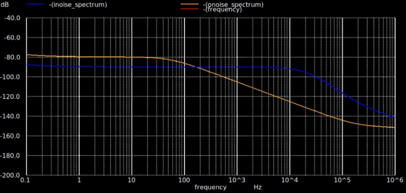
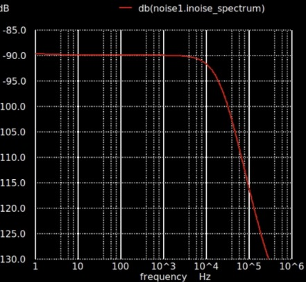
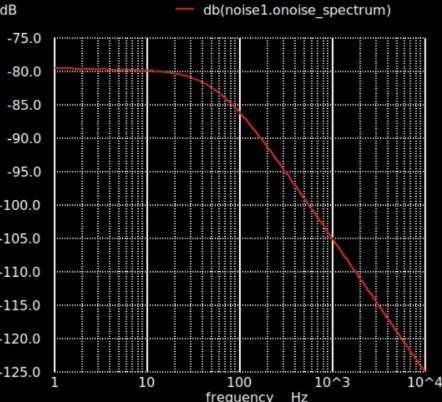

# Switched-Cap Low Pass Filter
For the low-pass filter (LPF) design, the MIMCAP B version was used. This component is not included by default in the gLayout library but was added as an extended version developed by one of the Chipathon participants. The updated MIMCAP B cell can be accessed from the [Mimcap B Repository](https://github.com/ReaLLMASIC/gLayout/pull/54)
## Schematic Design

  

<h4 align="center" style="font-size:16px;">Figure 1(a). LPF Schematic Inside Chip</h4>

  

<h4 align="center" style="font-size:16px;">Figure 1(b). LPF Schematic With External Ceramic Capacitor and Inductor</h4>

## Simulation

  

<h4 align="center" style="font-size:16px;">Figure 2. Switched-Cap Low Pass Filter Testbench</h4>

  

<h4 align="center" style="font-size:16px;">Figure 3. Noise Analysis (1) Result</h4>

  

<h4 align="center" style="font-size:16px;">Figure 4. Noise Analysis (2) Result</h4>

  

<h4 align="center" style="font-size:16px;">Figure 5. Noise Analysis (3) Result</h4>

## Performance of Designed Switched-Cap Low Pass Filter

| **Parameter**           | **Value**      | **Unit**   |
|-------------------------|-------------|--------|
| Cutoff Frequency (fc)  | <250     | Hz     |
| Clock Frequency (fclk) | 4        | kHz     |

Note* : Capacitors have the size of 1u x 1u (m = 3)

