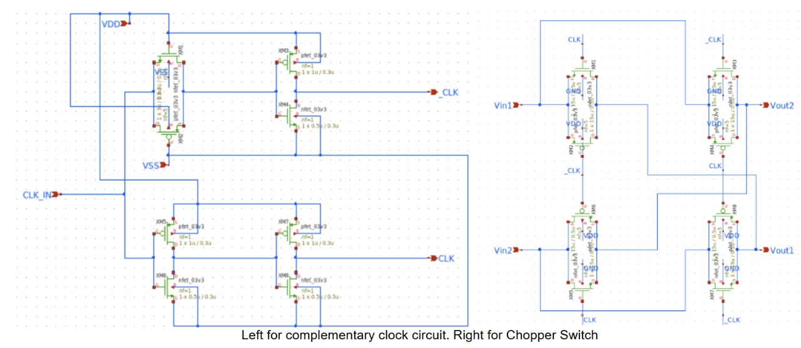
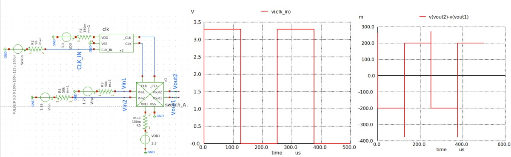
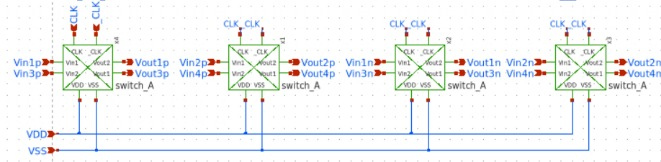
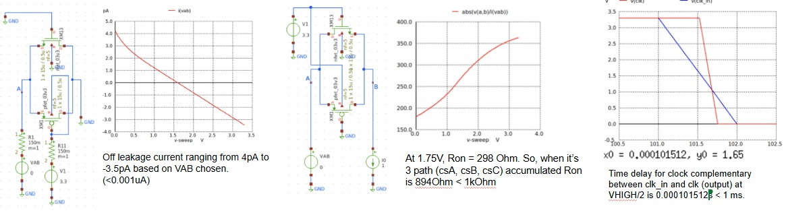

# Chopper Switch
The chopper switch network was also realized using the inverter primitive from gLayout to control the switching transistors.
## Schematic Design

  

<h4 align="center" style="font-size:16px;">Figure 1. Chopper Switch Schematic</h4>

## Simulation

  

<h4 align="center" style="font-size:16px;">Figure 2. Chopper Switch A Simulation</h4>

  

<h4 align="center" style="font-size:16px;">Figure 3. Chopper Switch B Simulation</h4>

  

<h4 align="center" style="font-size:16px;">Figure 4. Chopper Switch C Schematic</h4>

  

<h4 align="center" style="font-size:16px;">Figure 5. Chopper Switch C Testbench</h4>

  

<h4 align="center" style="font-size:16px;">Figure 6. Chopper Switch C Simulation 1</h4>

  

<h4 align="center" style="font-size:16px;">Figure 7. Chopper Switch C Simulation 2</h4>

  

<h4 align="center" style="font-size:16px;">Figure 8. Chopper Switch Specification</h4>

## Performance of Designed Chopper Switch 

| **Parameter**                        | **Value / Target** | **Unit** |
|-------------------------------------|--------------------|----------|
| Stage 1 : Chopper A Operating Frequency       | 4              | kHz       |
| Stage 2 : Chopper B Operating Frequency       | 2            | kHz       |
| Stage 3 : Chopper C Operating Frequency       | 1               | kHz       |
| Ron                                 | 894 (3 ways)                | kΩ       |
| Delay Time Between stages | +/-500              | ns       |
| Off Leakage Current | +/- 4 | pA
| Clock divider (to _Clk and Clk) delay | 0.000101512 | s

## Layout

  

<h4 align="center" style="font-size:16px;">Figure 9. Chopper Switch Layout</h4>

## Post-PEX

  

<h4 align="center" style="font-size:16px;">Figure 10. Chopper Switch Post-Pex</h4>

