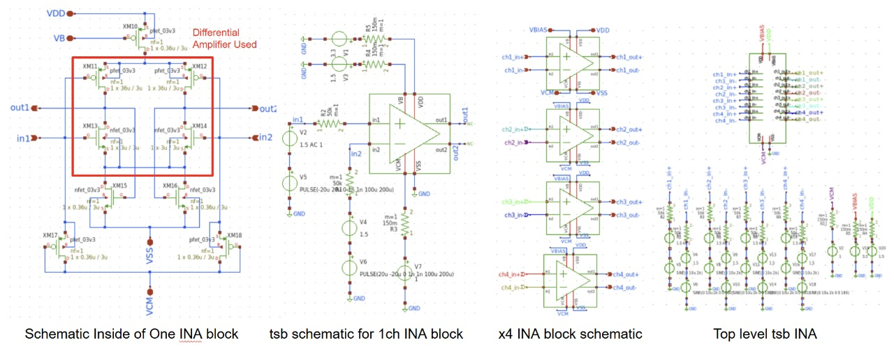
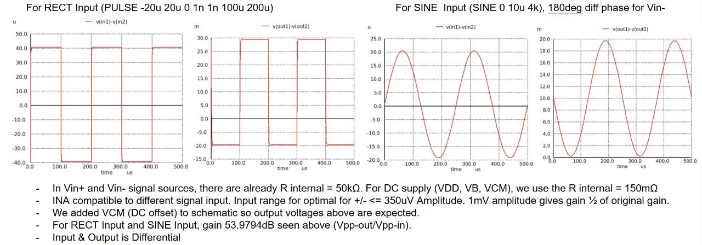

# Instrumentation Amplifier
The design of the fully differential operational amplifier was carried out using the gm/Id approach to determine the optimal transistor dimensions for the desired performance parameters.
## Schematic Design

  

<h4 align="center" style="font-size:16px;">Figure 1. Individual Instrumentation Amplifier Schematic</h4>

## Simulation

  

<h4 align="center" style="font-size:16px;">Figure 2. Instrumentation Amplifier Testbench</h4>

  

<h4 align="center" style="font-size:16px;">Figure 3. Gain Testbench Result</h4>

  

<h4 align="center" style="font-size:16px;">Figure 4. CMRR Testbench Result</h4>

## Performance of Designed Instrumentation Amplifier

| **Parameter**            | **Typical Value** | **Unit**   |
|----------------------|----------------|--------|
| Open-Loop Gain       | >53.9            | dB     |
| Bandwidth            | +/-10           | kHz     |
| Phase Margin         | >60           | degrees|
| UGF | 33 | MHz | 
| Power Supply Rejection Ratio (PSRR) | 58.17  | dB     |
| Common-Mode Rejection Ratio (CMRR) | 75.71    | dB     |
| Power | +/- 50 | uW
| Input range (INA) | <=350 | uV |

## Layout

  

<h4 align="center" style="font-size:16px;">Figure 5. INA Layout</h4>

## Post-PEX Simulation

  

<h4 align="center" style="font-size:16px;">Figure 6. Post-PEX Simulation</h4>
