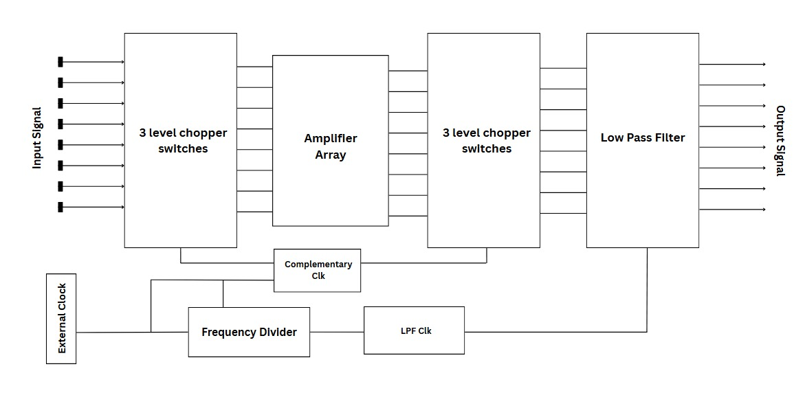
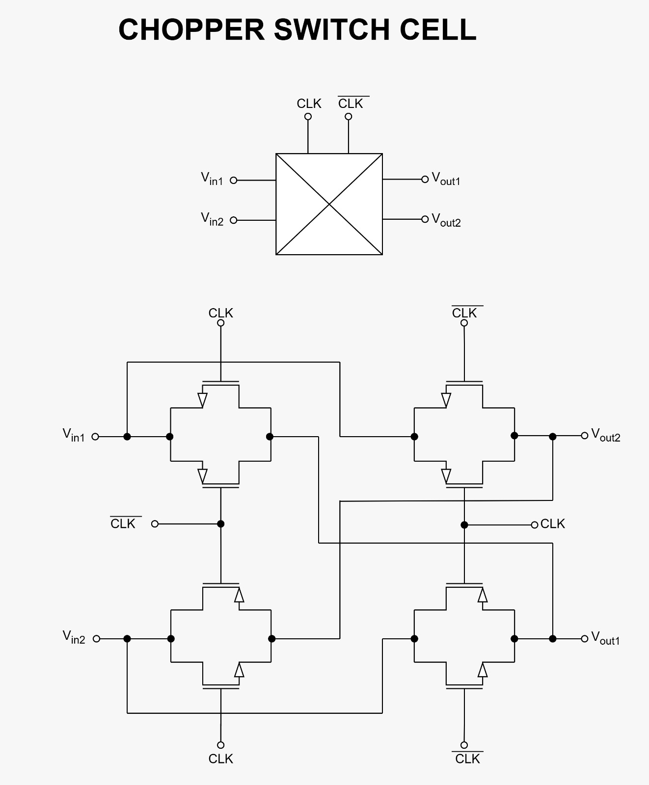
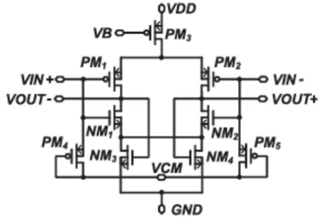
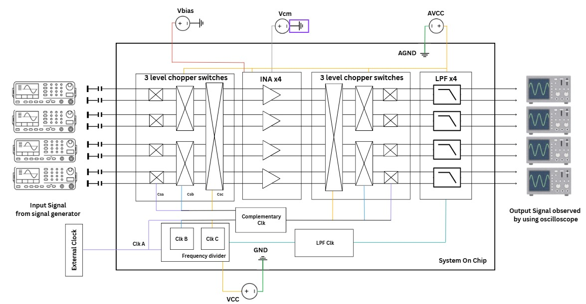
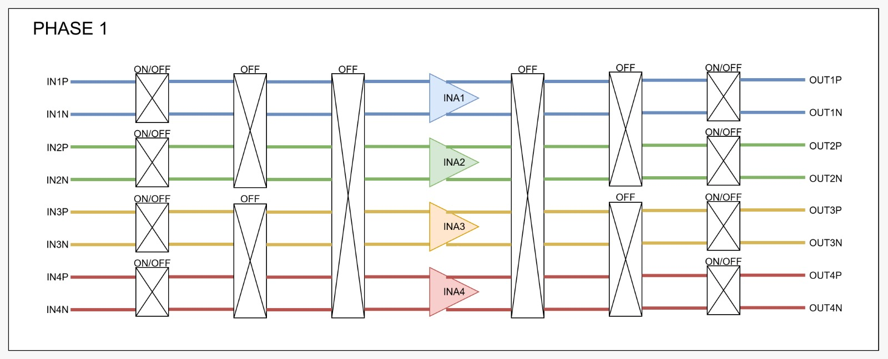
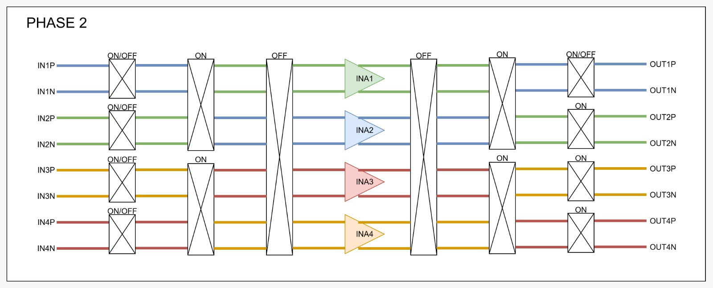
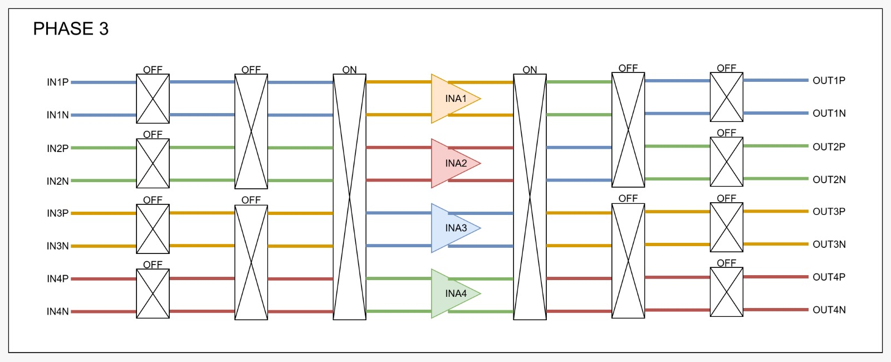
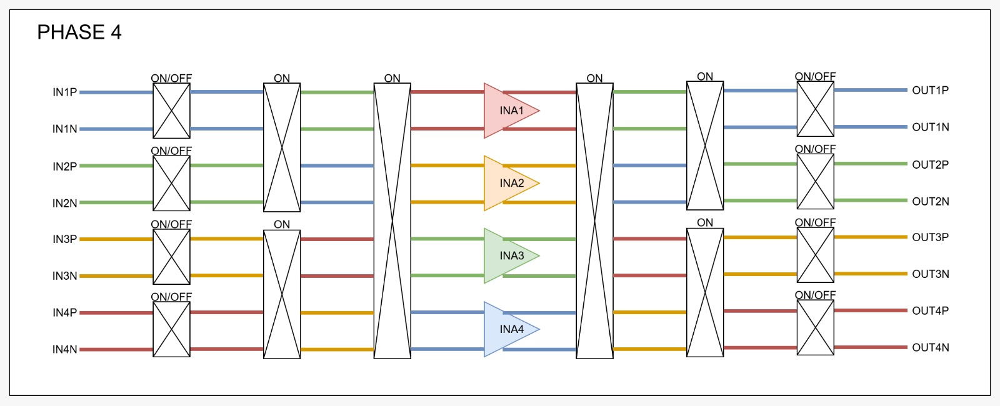

# Low Mismatch 4 Channels Instrumentation Amplifier for Electroencephalography (EEG) Measurement

## **GenYZ Team**  
### *Made with GF180MCU PDK and [gLayout](https://github.com/ReaLLMASIC/gLayout)*
---
## Datasheet
### **1. Functionality and Target Specifications**
This chip is a high-precision, low mismatch instrumentation amplifier array specifically designed for multichannel Electroencephalography (EEG) signal measurement. This instrumentation amplifier employs a group-chopping technique, in which multiple chopper switches (MOSFETs) are cascaded to sequentially exchange differential input signals across channels. This cyclic routing allows each input to be amplified by every amplifier in the array, effectively averaging out gain mismatches across channels. Additionally, input-referred DC offset is mitigated through chopper modulation and demodulation, which shifts low-frequency noise and offset to higher frequencies where they can be filtered out. As a result, the amplification across all channels becomes uniform and free from bias. 
<h4 align="center" style="font-size:16px;">Table 1. Target Specification</h4>

| **Parameter**                  | **Target Specs**           | **Notes**                                                                 |
|-------------------------------|----------------------------|---------------------------------------------------------------------------|
| Number of Channels            | 4                          | Scalable up to 8, 16, or more (depends on functionality of chip)         |
| Supply Voltage                | 3.3 V (Analog), 1.2 V (Digital) [1] | Analog supply for chopper switches, digital for clocks                    |
| Input-Referred Noise          | 39 nV/√Hz [1]              | -                                                                                                           |
| Area per Channel              | 0.017 mm² [1]              | -                                                                         |
| Power Consumption per Channel | <200uW                | At 3.3 V supply                                                           |
| NEF (Noise Efficiency Factor) | 2.1 [1]                    | Very low noise relative to power                                          |
| Gain Mismatch Between Channels| 400 ppm [1]                | Approximate value                                                        |

### **2. Block Diagram**

<h4 align="center" style="font-size:16px;">Figure 1. Block Diagram of the System Design</h4>

The analog circuit blocks were designed using the [gLayout](https://github.com/ReaLLMASIC/gLayout) framework, while the digital blocks were implemented separately. Both were then integrated into a single functional chip layout using KLayout, resulting in the final GDS file.

<h4 align="center" style="font-size:16px;">Table 2. Complexity and Functionality of Each Block Diagram</h4>

| **Block Components**        | **Function**                                                                 | **Complexity Scale** | **Note**                                                                                                                                       |
|----------------------------|-------------------------------------------------------------------------------|----------------------|------------------------------------------------------------------------------------------------------------------------------------------------|
| Chopper Switch             | Reduction of flicker (1/f) Noise, Modulation, and Demodulation of Frequency  | High                 | Multi-phase clock for multi-level chopper switches                                                                                             |
| INA (Instrumentation Amplifier Array) | Amplify differential bipotential signal from each channel with high CMRR | High                 | - Uses time-division multiplexing across channels    - Fast time settlement required for quick switching    - Correct VBias for FET ops   - 9 FETs per INA; optimize power |
| Low Pass Filter (LPF)      | Suppress high-frequency noise from the bipotential signal                     | Low                  | Simple analog RC circuit using several capacitors                                                                                              |
| Frequency Divider          | Divide clock signal based on required frequencies                            | Moderate (Medium)    | - Converts high-freq clock into clkA, clkB, clkC using sequential logic   - Uses flip-flops and handles clock edges   - Easily scalable  |
| Clock Generator            | Generate clock signal with specific frequency                                | Low                  | Digital block generating logic level 1 and 0 in a specific frequency range                                                                    |

### **3. Components Specification**

*A. Chopper Switch*

The chopper switch is implemented to reduce low-frequency (1/f) noise and input offset voltage that can severely degrade the quality of EEG signals. It operates by modulating the input signal with a square wave, shifting it to a higher frequency band where amplifier noise is more uniform and less intrusive. After amplification, the signal is demodulated back to baseband, effectively canceling out the low-frequency noise and offset introduced by the amplifier. 

  

<h4 align="center" style="font-size:16px;">Figure 2. Chopper Switch Cell [4]</h4>

  

<h4 align="center" style="font-size:16px;">Figure 3. Adoption of the Chopper Switch Cell [4]</h4>

<h4 align="center" style="font-size:16px;">Table 3. Target Specification of Chopper Switch</h4>

| **Parameter**                        | **Value / Target** | **Unit** |
|-------------------------------------|--------------------|----------|
| Stage 1 : Chopper A Operating Frequency       | 4              | kHz       |
| Stage 2 : Chopper B Operating Frequency       | 2            | kHz       |
| Stage 3 : Chopper C Operating Frequency       | 1               | kHz       |
| Ron                                 | <1                | kΩ       |
| Delay Time Between stages | +/-500              | ns       |
| Off Leakage Current | <0.1 | uA
| Clock divider (to _Clk and Clk) delay | <1 | ms |

🔗**File**: [Chopper Switch](Chopper%20Switch)

*B. Instrumentation Amplifier*

An open-loop amplifier is used to provide high gain for low-amplitude EEG signals while minimizing power and silicon area. Unlike closed-loop designs that require additional components such as compensation networks and feedback resistors, open-loop amplifiers offer a simpler architecture with fewer transistors and passive elements. This results in a significantly smaller layout footprint, making it ideal for compact, low-power multi-channel EEG systems where area efficiency is critical.

  

<h4 align="center" style="font-size:16px;">Figure 4. Open-Loop Amplifier [1]</h4>

<h4 align="center" style="font-size:16px;">Table 4. Target Specification of Open-Loop Amplifier</h4>

| **Parameter**            | **Typical Value** | **Unit**   |
|----------------------|----------------|--------|
| Open-Loop Gain       | >50            | dB     |
| Bandwidth            | +/-10           | kHz     |
| Phase Margin         | >60           | degrees|
| UGF | 10 - 40 | MHz | 
| Power Supply Rejection Ratio (PSRR) | +/- 60  | dB     |
| Common-Mode Rejection Ratio (CMRR) | >= 80    | dB     |
| Power | < 500 | uW
| Input range (INA) | <=350 | uV |

🔗**File**: [Instrumentation Amplifier](Instrumentation%20Amplifier)

*C. Low Pass Filter*

The switched-capacitor low-pass filter is used to remove high-frequency components after chopper demodulation, recovering the clean baseband EEG signal. Instead of relying on physical resistors, which can consume significant area and vary with process, the filter uses capacitor ratios and a clock signal to define its cutoff frequency precisely. This makes it highly area-efficient, tunable, and well-suited for integration in CMOS processes. The switching operation emulates a resistor using charge transfer, allowing for compact, accurate, and fully integrated filtering essential in low-power EEG front-end systems.

  

<h4 align="center" style="font-size:16px;">Figure 5. Switched-Cap Low-Pass Filter [1]</h4>

<h4 align="center" style="font-size:16px;">Table 5. Target Specification of Switched-Cap Low Pass Filter</h4>

  
| **Parameter**           | **Value**      | **Unit**   |
|-------------------------|-------------|--------|
| Cutoff Frequency (fc)  | <250        | Hz     |
| Clock Frequency (fclk) | 4         | kHz     |

🔗**File**: [Switched-Cap Low Pass Filter](Switched-Cap%20Low%20Pass%20Filter)

*D. Dummy EEG Signal*

To validate the functionality and performance of the designed multi-channel EEG front-end system, a realistic dummy EEG signal is required as input for the simulation testbench. This is essential to ensure that each stage of the analog front-end—such as amplification, chopping, filtering, and timing circuits—responds correctly to signals that closely mimic real-world conditions. In this project, a 4-channel EEG signal (comprising 8 nodes for differential input: 4 positive and 4 negative) is constructed using publicly available data from the Mendeley EEG Motor Movement/Imagery Dataset. This dataset provides authentic EEG waveforms that capture typical amplitude, frequency, and noise characteristics encountered in actual biomedical recordings. By applying these signals to the testbench, it becomes possible to evaluate the accuracy, signal integrity, and inter-channel consistency of the system under realistic operating conditions.

<h4 align="center" style="font-size:16px;">Table 6. Characteristic of Dummy EEG Signals</h4>

| **Activity**                     | **Frequency Range (Hz)** | **Amplitude Range (μV)** |
|-----------------------------|--------------------------|------------------------|
| Baseline Eyes Open          | 2.25 – 30.94    | 20.03 – 174.53            |
| Closing Left Hand       | 2.99 – 12.72     | 1.49 – 8.29               | 
| Closing Right Hand        | 4.99 – 46.41     | 9.41 – 108.74               | 
| Dorsal flexion of Left Foot        | 0.50 – 41.17                    | 1.41 – 6.02              | 
| Plantar flexion of Left Foot        | 4.99 – 29.44                     | 1.52 – 5.40               |                 
| Dorsal flexion of Right Foot             | 8.98 – 34.43                    | 1.52 – 4.67              |                 
| Plantar flexion of Right Foot            | 7.98 – 13.97                    | 1.66 – 3.92              |      
| Resting in Between Tasks          | 0.00 – 40.67                    | 9.86 – 124.15            |      

Dataset DOI: 10.17632/x8psbz3f6x.2

🔗**File**: [EEG Dummy Signal](EEG%20Dummy%20Signal)

*E. Frequency Divider*

The frequency divider circuit is designed to generate synchronized clock signals required by various timing-dependent blocks, such as the switched-capacitor LPF and chopper switch. It operates by dividing an input clock by two at each stage, producing sequentially halved frequencies (e.g., f, f/2, f/4, etc.) suitable for multi-stage operations. To ensure proper timing alignment and avoid glitches, a fixed delay of 500 ns is introduced at each division stage. This controlled delay spacing also helps with phase management and ensures predictable timing between clock signals, which is critical for maintaining accurate sampling and modulation sequences across the system.

  

<h4 align="center" style="font-size:16px;">Figure 6. Clocking Scheme [1]</h4>

<h4 align="center" style="font-size:16px;">Table 7. Target Specification of Frequency Divider</h4>

  
| **Parameter**                        | **Value / Target** | **Unit** |
|-------------------------------------|--------------------|----------|
| Chopper A Operating Frequency       | 4              | kHz       |
| Chopper B Operating Frequency       | 2            | kHz       |
| Chopper C Operating Frequency       | 1               | kHz       |

🔗**File**: [Frequency Divider](Frequency%20Divider)

### **4. Pin Out**

<h4 align="center" style="font-size:16px;">Figure 7. Chip Architecture</h4>

<h4 align="center" style="font-size:16px;">Table 3.  External Pin Function</h4>

<table>
  <thead>
    <tr>
      <th><b>Pin</b></th>
      <th><b>Name</b></th>
      <th><b>Type</b></th>
      <th><b>Direction</b></th>
      <th><b>Description</b></th>
    </tr>
  </thead>
  <tbody>
    <tr><td align="center">1</td><td>AVDD</td><td>3V3 Power</td><td>Bidirectional</td><td>Analog Supply Voltage</td></tr>
    <tr><td align="center">2</td><td>AVSS</td><td>Ground</td><td>Bidirectional</td><td>Analog Ground</td></tr>
    <tr><td align="center">3</td><td>VDD</td><td>5V Power</td><td>Bidirectional</td><td>Digital Supply Voltage</td></tr>
    <tr><td align="center">4</td><td>VSS</td><td>Ground</td><td>Bidirectional</td><td>Digital Ground</td></tr>
    <tr><td align="center">5</td><td>IN1P</td><td>Analog</td><td>Input</td><td>Channel 1 Analog Positive Input</td></tr>
    <tr><td align="center">6</td><td>IN1N</td><td>Analog</td><td>Input</td><td>Channel 1 Analog Negative Input</td></tr>
    <tr><td align="center">7</td><td>IN2P</td><td>Analog</td><td>Input</td><td>Channel 2 Analog Positive Input</td></tr>
    <tr><td align="center">8</td><td>IN2N</td><td>Analog</td><td>Input</td><td>Channel 2 Analog Negative Input</td></tr>
    <tr><td align="center">9</td><td>IN3P</td><td>Analog</td><td>Input</td><td>Channel 3 Analog Positive Input</td></tr>
    <tr><td align="center">10</td><td>IN3N</td><td>Analog</td><td>Input</td><td>Channel 3 Analog Negative Input</td></tr>
    <tr><td align="center">11</td><td>IN4P</td><td>Analog</td><td>Input</td><td>Channel 4 Analog Positive Input</td></tr>
    <tr><td align="center">12</td><td>IN4N</td><td>Analog</td><td>Input</td><td>Channel 4 Analog Negative Input</td></tr>
    <tr><td align="center">13</td><td>OUT1P</td><td>Analog</td><td>Output</td><td>Channel 1 Analog Positive Output</td></tr>
    <tr><td align="center">14</td><td>OUT1N</td><td>Analog</td><td>Output</td><td>Channel 1 Analog Negative Output</td></tr>
    <tr><td align="center">15</td><td>OUT2P</td><td>Analog</td><td>Output</td><td>Channel 2 Analog Positive Output</td></tr>
    <tr><td align="center">16</td><td>OUT2N</td><td>Analog</td><td>Output</td><td>Channel 2 Analog Negative Output</td></tr>
    <tr><td align="center">17</td><td>OUT3P</td><td>Analog</td><td>Output</td><td>Channel 3 Analog Positive Output</td></tr>
    <tr><td align="center">18</td><td>OUT3N</td><td>Analog</td><td>Output</td><td>Channel 3 Analog Negative Output</td></tr>
    <tr><td align="center">19</td><td>OUT4P</td><td>Analog</td><td>Output</td><td>Channel 4 Analog Positive Output</td></tr>
    <tr><td align="center">20</td><td>OUT4N</td><td>Analog</td><td>Output</td><td>Channel 4 Analog Negative Output</td></tr>
    <tr><td align="center">21</td><td>VBIAS</td><td>Analog</td><td>Bidirectional</td><td>Biasing Voltage for Analog and Digital Components</td></tr>
    <tr><td align="center">22</td><td>CLK</td><td>Digital</td><td>Input</td><td>Clock as Digital Controller for Chopper Switches, etc.</td></tr>
    <tr><td align="center">23</td><td>VCM</td><td>Analog</td><td>Bidirectional</td><td>Common Mode Voltage</td></tr>
  </tbody>
</table>

### **5. Application Diagram**

<h4 align="center" style="font-size:16px;">Figure 8. Example Circuits Application</h4>

The application of this system is to amplify biopotential signals such as EEG, which are received from a 4-channel signal source. Each channel takes in two analog differential inputs from a pair of electrodes. The circuit outputs an analog signal (output signal), which can be observed on an oscilloscope.

The signal first passes through a chopper switch block, starting with CSa, which is implemented in each individual channel. This stage performs chopper-stabilization to suppress flicker noise (1/f noise) that typically dominates in low-frequency biomedical signals. The technique shifts the baseband signal to a higher frequency, where the noise floor is lower, and then demodulates it back to recover the clean signal.

In addition to CSa, this system includes two additional dynamic switches, CSb and CSc, which are activated in specific clock-controlled phases to perform dynamic offset cancellation and signal path swapping between adjacent channels. These switches improve the matching across channels by ensuring that each amplifier stage processes signals from different input sources over time.

The time-sequenced behavior of the switches is as follows:

<h4 align="center" style="font-size:16px;">Figure 9. Three Level Chopper Switches Phase 1</h4>

Phase 1: Only CSa is active. The signal flows straight through its assigned path:
- Ch1 → INA1
- Ch2 → INA2
- Ch3 → INA3
- Ch4 → INA4

<h4 align="center" style="font-size:16px;">Figure 10. Three Level Chopper Switches Phase 2</h4>

Phase 2: CSb is ON, performing the first set of signal path swaps between adjacent channel pairs:
- Ch1 → INA2
- Ch2 → INA1
- Ch3 → INA4
- Ch4 → INA3

<h4 align="center" style="font-size:16px;">Figure 11. Three Level Chopper Switches Phase 3</h4>

Phase 3: CSb turns OFF and CSc turns ON, causing the following routing:
- Ch1 → INA3
- Ch2 → INA4
- Ch3 → INA1
- Ch4 → INA2

<h4 align="center" style="font-size:16px;">Figure 12. Three Level Chopper Switches Phase 4</h4>

Phase 4: CSb and CSc turns ON, causing:
- Ch1 → INA4
- Ch2 → INA3
- Ch3 → INA2
- Ch4 → INA1
  
The Instrumentation Amplifiers (INA1–INA4) then amplify the incoming signals with high gain and excellent Common-Mode Rejection Ratio (CMRR), critical for extracting small EEG signals while rejecting noise and interferences.

Following amplification, a second chopper switch stage (also CSa) demodulates the signal back to its original low-frequency range. The signal then passes through a Low-Pass Filter (LPF) to eliminate residual high-frequency components introduced by the chopping process. The final output is a clean, amplified analog signal representing the original EEG input.

In summary, this example implementation of a 4-channel chopper amplifier system combines conventional chopper-stabilization (CSa) with dynamic signal path-switching (CSb and CSc) across three phases to achieve low-noise, high-accuracy biopotential signal amplification suitable for EEG applications.

---
# Teams
| No. | Name                        | Institutional Email              | Institution |
|-----|-----------------------------|----------------------------------|--------------|
| 1   | Aleta Edna Jessalyn         | aleta.edna01@gmail.com           | ITB          |
| 2   | Angelina Wahyuni Tambunan   | angelinatambunan2005@gmail.com   | ITB          |
| 3   | Keisya Andretta Basoeki     | andrettakeisya@gmail.com         | ITB          |
| 4   | Abdillah Aziz               | abdillahaziz129@gmail.com        | ITB          |
| 5   | Infall Syafalni             | infall@ieee.org                  | ITB          |

---
### **Reference**

[1] Tao Tang, Jeong Hoan Park, Lian Zhang, Kian Ann Ng, and Jerald Yoo. “Group Chopping: An 8-Channel, 0.04% Gain Mismatch, 2.1 uW 0.017 mm2 Instrumentation Amplifier for Bio-potential Recording". IEEE Journal of Solid-State Circuits, vol. 16, no. 3, pp. 1061–1071, Jun. 2022, doi: 10.1109/TBCAS.2022.3166513

[2] WhaleTeq Medical Device Manufacturer. “CMRR Test Principle and Method.” Accessed from https://www.whaleteq.com/en/app/view18-cmrr-test-principle-and-method at July 9th, 22.19 PM UTC+7.00.

[3] S. Yazicioglu, T. Torfs, P. Merken, H. Kim, J. Penders, R. F. Yazicioglu, and C. Van Hoof, “A 0.5 V 2.1 µW EEG acquisition IC with differential and common-mode active DC offset rejection,” IEEE Journal of Solid-State Circuits, vol. 57, no. 4, pp. 1061–1071, Apr. 2022, doi: 10.1109/JSSC.2022.3161704.

[4] Z. Yao, X. Zhou, D. Huang, W. Wu, and M. Je, "A 0.8 μW/Channel Readout IC for Sub-µV/√Hz Noise Scalable EEG Acquisition System With an Analog Accumulator and a Fully Digital Chopper," Sensors, vol. 25, no. 4, p. 1157, Feb. 2025. doi: 10.3390/s25041157
