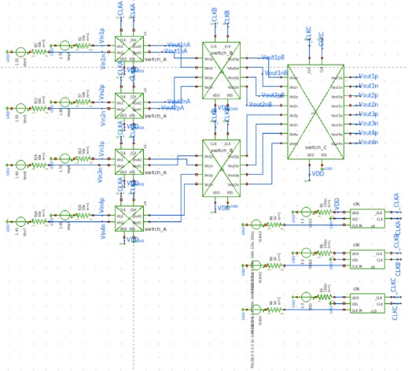
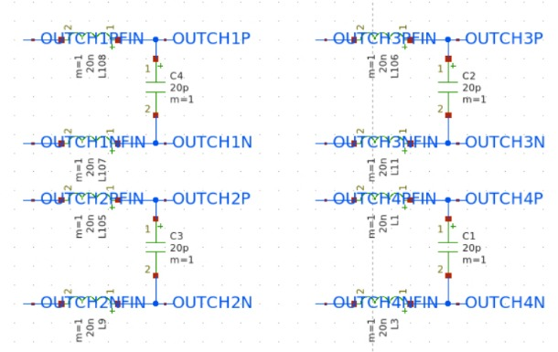
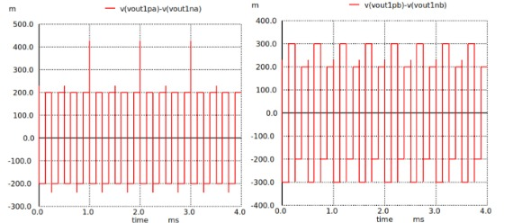
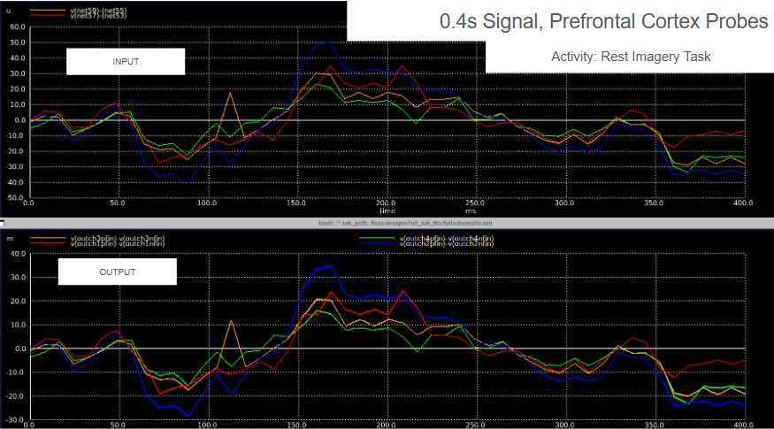

# Top Level Integration

The top-level integration connects the EEG front-end signal path through three stages of chopper switches (CsA, CsB, and CsB_) feeding into an instrumentation amplifier (INA), followed by another three-stage chopper switch set (CsC, CsB, CsA) and finally a switched-capacitor low-pass filter (LPF). Complementary clocks drive all chopper switches to ensure proper modulation and demodulation, suppressing low-frequency offsets and 1/f noise, while the INA amplifies the differential signal with high input impedance and low noise. The fully integrated digital clocks and precise timing enable a compact, low-power CMOS implementation that delivers a clean baseband EEG output ready for further processing.

**NOTE** : You can run full integration analog circuit netlist (CS-INA-CS-LPF, complementary clk) + digital circuit netlist (Frequency divider) by accessing the .spice from the **Top Integration .spice Folder**. Both result, using PULSE as alternative from digital and using PWL from csv provided from the digital (OpenLane) netlist give the same gain result & waveforms.

For the layout implementation, two GDS versions are provided:
- A full analog layout, generated using the gLayout framework in a Jupyter Notebook environment, and
- A fully integrated layout, combining the analog front-end with the digital block designed in OpenLane, merged and finalized using KLayout.

Analog and digital ESD from [SSCS-Chipathon-2025 analog tracks participants](https://github.com/sscs-ose/sscs-chipathon-2025/tree/main/resources/Integration/Chipathon2025_pads) are used.
## Schematic Design of 3 Chopper Switches Integration

  

<h4 align="center" style="font-size:16px;">Figure 1. Integrated Schematic of 3 Switches</h4>

## Schematic Design of Top Integrated Circuit

  

<h4 align="center" style="font-size:16px;">Figure 2. Integrated Schematic of the System</h4>

## Schematic Design of External Capacitor (Off-Chip)

  

<h4 align="center" style="font-size:16px;">Figure 3. External Capacitor Circuit for Outputs (off-chip)</h4>

## Simulations of Top Integration Level Chopper Switches

  

<h4 align="center" style="font-size:16px;">Figure 4. Chopper Switches Integrated TB (1)</h4>

  

<h4 align="center" style="font-size:16px;">Figure 5. Chopper Switches Integrated TB (1)</h4>

## Simulations of Top Integration Level Full Circuit

  

<h4 align="center" style="font-size:16px;">Figure 6. Output Signals per-Stage in Top Integration (1)</h4>

  

<h4 align="center" style="font-size:16px;">Figure 7. Output Signals per-Stage in Top Integration (2)</h4>

  

<h4 align="center" style="font-size:16px;">Figure 8. Simulation Prefrontal Cortex Probes (Input and Output)</h4>

