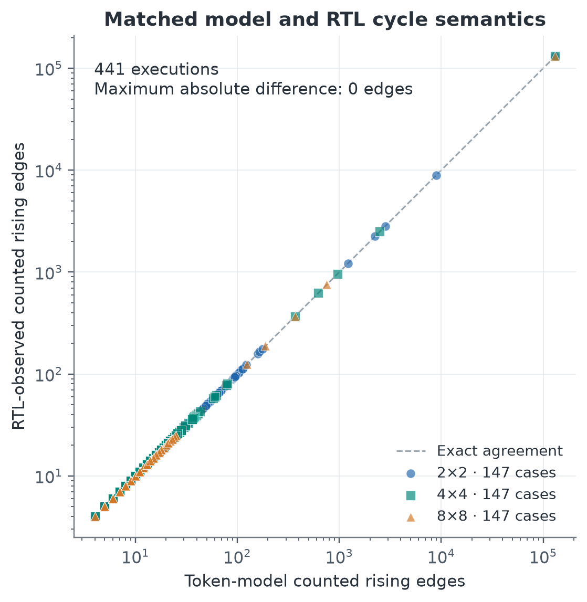

# Model2GDS: An Auditable Model-to-RTL Workflow for Reproducible Systolic-Array Design

Explore a parameterized **2×2 / 4×4 / 8×8 output-stationary systolic array**
with an independent numerical model, an independent token-cycle model and
parameterized SystemVerilog RTL. Across
**441 accepted case/configuration executions**,
the models and captured RTL agree exactly on numerical results and cycle counts.

**[Open the executable Jupyter notebook](Model2GDS.ipynb)** to inspect the design,
replay the verification, and follow the reproducible
**raw evidence → parser → structured result → figure** workflow.
A separate tiny-counter design proves the open-source RTL-to-GDS toolchain.

## Key results

| Result | Model2GDS |
|---|---|
| Array sizes | 2×2 / 4×4 / 8×8 |
| Accepted executions | **441** |
| Numerical agreement | **441 / 441** |
| Cycle agreement | **441 / 441** |
| Models | Independent numerical + token-cycle |
| RTL | Parameterized SystemVerilog |
| Reproduction | Executable notebook + offline replay |



*Exact cycle agreement across the accepted corpus. Coincident points can overlap;
this verifies cycle semantics and does not measure physical frequency.*

**Yixuan Zhuang — School of Microelectronics, Fudan University**  
Contact: yixuanzhuangfudan@gmail.com · [Team metadata](TEAM.json)

## Offline reproduction

Use Python 3.12 with the recorded dependency versions. From this directory:

```bash
python -m venv .venv
. .venv/bin/activate
python -m pip install -r requirements.txt
python scripts/build_submission.py --verify-package
python scripts/reproduce_figures.py --root . --portable --check
python scripts/build_submission.py --execute-notebook
```

On Windows, activate `.venv/Scripts/Activate.ps1`.
JupyterLab can also open the notebook and run all cells. The offline verification
needs only Python's standard library; display/plot dependencies are listed above.
Nothing in this workflow invokes a simulator, synthesis, P&R, STA or Docker.
`--execute-notebook` runs cells in memory and preserves the bundled source bytes.
The exact observed notebook dependency versions are in `support/notebook_runtime.json`.

The replay recomputes GEMM/token results from preserved inputs and compares them
with the recorded RTL observations. It reparses the tiny-counter raw evidence and
regenerates analysis/figures, without running a simulator or physical flow.
Raw command records retain historical machine paths solely as provenance.

## What is included

- `Model2GDS.ipynb`: the narrative and executable checks.
- `model/`, `rtl/`, `verification/`: independent references and synthesizable fabric/harness.
- `results/processed/`: immutable accepted functional/counter data and final analysis.
- `results/raw/`: captured simulation and counter RTL-to-GDS sources for displayed claims.
- `figures/final/`: deterministic figures and their source manifest.
- `file_manifest.json`: exact SHA256 and byte size of every package file, excluding itself.
- `environment/toolchain.lock.json`: recorded tool, PDK and library versions.
- `docs/`: arithmetic, cycle, workload and final-analysis contracts.

[REBUILD.md](REBUILD.md) describes optional fresh Verilator and pinned OpenLane
runs from bundled sources, with outputs kept in a separate work directory.
The notebook and these rebuild demonstrations are self-contained. The complete
development history and qualification records are available from the author.

## Scope and submission

The tiny counter proves the ASIC toolchain; it is never an accelerator result.
Accelerator physical qualification is incomplete: the final 2×2 implementation
qualified, 4×4 did not pass final antenna signoff, and 8×8 was therefore not run.
Incomplete physical families and rejected physical metrics are excluded from
comparative performance and ranking claims. No silicon Fmax, power/energy or
process-variation result is claimed. The notebook retains the qualification
summary and expandable provenance.

Apache-2.0 project license: `LICENSE`. GDS cell attribution: `NOTICE` and
`third_party/`. Primary references: `REFERENCES.md`.
Official rule provenance: `support/official_rules.json`. Place this entire folder
under `ISSCC27/submitted_notebooks/Model2GDS/` in the official fork; change no other
project. Team and contact details are in `TEAM.json`.
