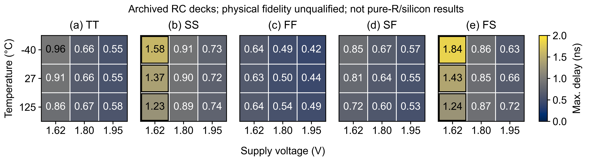

# Comparator Atlas: When Calibration Is Not Enough

**Wei-Lun Hsu — National Tsing Hua University**  
IEEE SSCS Code-a-Chip · ISSCC 2027 · MIT License

[Notebook](https://github.com/WLHsu0827/sscs-ose-code-a-chip.github.io/blob/wlhsu0827-comparator-atlas-isscc27/ISSCC27/submitted_notebooks/comparator_atlas/Comparator_Atlas.ipynb) |
[Run in Colab](https://colab.research.google.com/github/WLHsu0827/sscs-ose-code-a-chip.github.io/blob/wlhsu0827-comparator-atlas-isscc27/ISSCC27/submitted_notebooks/comparator_atlas/Comparator_Atlas.ipynb) |
[Quick tour](REVIEWER_GUIDE.md) |
[Reproduction instructions](REPRODUCIBILITY.md)

Download the [interactive report](results/study/report.html) and open the
HTML file locally; GitHub's file viewer does not execute its JavaScript.
The Waveform Lab provides eight recorded
examples with a deadline cursor and complementary-rail thresholds.
View or download the [poster PDF](results/study/Comparator_Atlas_Poster.pdf)
or its [preview image](results/study/poster_preview.png).

## Overview

Calibrating offset does not tell us whether the comparator will decide before
the deadline. Here, a SKY130 StrongARM comparator is sized, calibrated and
tested across PVT conditions, then laid out and simulated with extracted
parasitics. The saved waveforms show which decisions are wrong and which simply
have not settled in time. The study compares nine candidate designs, checks a
lower-energy alternative and lays out the selected 27-transistor circuit.

## Results

**Archived RC-deck outcomes; model physical fidelity not yet qualified.**

**Read the RC results as simulations of the archived extraction, not measured
silicon performance.** The pinned Magic/open_pdks flow retains coupling
capacitance while grounded capacitance increases. The C-only netlist is not an
independent reference, so the RC-versus-C difference cannot be assigned to
resistance alone. Its physical error has not been established; DRC/LVS and
timestep checks cannot settle that question. This does not affect the schematic
comparison. [Extraction details and limits](REPRODUCIBILITY.md#archived-rc-model-applicability).

The schematic comparison uses the same local calibration policy, a 1 ns
deadline and sampled absolute inputs of at least 1 mV:

| Design | Correct / points | Fully passing conditions | Mean core energy (fJ) | Gate-area proxy (um2) |
| --- | ---: | ---: | ---: | ---: |
| `baseline` | 310/392 | 16/49 | 143.01 | 10.83 |
| `lvt_balanced_4b` | 372/392 | 29/49 | 251.53 | 20.55 |
| `lvt_base_3b` | 351/392 | 18/49 | 156.65 | 10.83 |

These are finite-grid results: 45 PVT combinations at controlled width
stress plus four nominal controls. The lower-energy candidate was evaluated
after the original selection.

The physical implementation passes the recorded DRC/LVS and negative controls.
Its full nominal, code-zero study covers **45 PVT conditions and four signed
inputs per condition**. Schematic and extracted RC were simulated under the
same ngspice-47 settings and checked at 10/5 ps.

| Nominal full-grid result | Schematic | Extracted RC |
| --- | ---: | ---: |
| Correct at 1 ns | 180/180 | 156/180 |
| Correct at the declared 2 ns deadline | 180/180 | 180/180 |
| Mean core energy (fJ/cycle) | 245.84 | 425.49 |

The slowest RC sample is **1.835 ns at FS / 1.62 V /
-40 C / -3 mV**. The 24 remaining 1 ns points are unresolved, not wrong.
The earlier five-condition ngspice-42 layout pilot remains a separate record:
12/20 RC points met its original 1 ns target; 20/20 met a retained 2 ns window.
The full-grid 2 ns criterion was declared separately rather than rewriting that
pilot's result.

To see how close the slowest point is to the 2 ns deadline, we reran it and
one TT point with seven *hypothetical* R/C settings each at 10 and 5 ps:
[28 transients and 14 matching numerical pairs](REPRODUCIBILITY.md#bounded-rc-sensitivity-check).
The TT point remains correct at both deadlines. The slowest FS point is
correct at 2 ns in the original deck but unresolved if all 319 internal
capacitor cards are scaled by 1.2, with or without also scaling its 675
resistor cards by 1.2. The 20% change is a test setting, not a measured
process-error range; these two points cannot determine the pass rate of
the perturbed 45-condition grid. The [plan](results/study/rc_sensitivity/plan.json),
[measurements](results/study/rc_sensitivity/summary.json) and
[rerun script](reproduction/pvt45/run_rc_sensitivity.py) are included.

A separate [GDS geometry check](results/study/gds_geometry/README.md) measures
selected conductors and calculates isolated sheet-resistance and plate-area
terms. It is not a full-net PEX reference: although all 15 GDS ports can be
restored, imported RC segmentation and capacitor values still differ from
the archived MAG extraction.



Each cell is the maximum over four signed inputs. Black outlines mark
conditions with a missed 1 ns sample. [Vector PDF](results/study/postlayout_pvt45/figures/pvt45_timing.pdf).
The [independent public-waveform check](REPRODUCIBILITY.md#independent-public-waveform-check)
remeasures ten saved post-layout traces at both deadlines; those selected
examples do not replace the full-grid record audit.

## Run

Open the notebook in Colab and run all cells, or run locally:

```text
python -m pip install -r requirements-review.txt
python -m pytest --nbmake --nbmake-timeout=600 Comparator_Atlas.ipynb
```

Default execution analyzes the supplied data and remeasures saved waveforms.
Fresh SPICE examples and the full campaign are optional notebook modes.
The Colab link uses the submitted fork before upstream merge.
The project requires no commercial EDA license or paid API key.
Local CPU execution is supported; Colab's free tier has resource limits.

## Files

- `Comparator_Atlas.ipynb` — circuit, methods, plots and discussion.
- `comparator_atlas/` — simulation, calibration and analysis code.
- `results/study/` — measurements, figures, report, poster and abstract.
- `layout_compact_repair/` — final layout, extraction and physical evidence.
- `REPRODUCIBILITY.md` — tool versions, data map and complete run commands.

## Scope

The calibrated schematic and nominal-layout experiments have different scopes.
Full-grid layout inputs are limited to -10, -3, +3 and +10 mV at code zero;
five conditions had been observed previously, and this is not a blinded test.
Core energy excludes external drivers and calibration infrastructure.
The results are deterministic simulations, not silicon measurements or
foundry statistical yield. References and detailed conditions are in the
notebook.

## License and acknowledgment

Original code is [MIT licensed](LICENSE). Third-party notices are retained
in [THIRD_PARTY_NOTICES.txt](THIRD_PARTY_NOTICES.txt).
GitHub Copilot assisted implementation, experiment automation, figures and
documentation; the author is responsible for the work.
