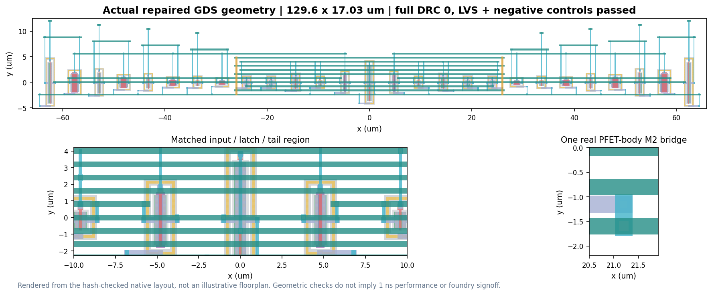

# Layout and extracted-circuit results

**Archived RC-deck outcomes; model physical fidelity not yet qualified.**
The pinned Magic/open_pdks pipeline retains mutual capacitances while grounded
capacitance increases. Physical error size and direction are unknown; no exact
duplication factor or corrected counts or energy are inferred. C-only is not
independent ground truth; RC-versus-C performance differences cannot be attributed
solely to resistance. DRC/LVS establish structural checks, not parasitic-model
fidelity. Schematic results are unaffected by this extraction concern.
This limitation applies to both studies and all archived comparisons below;
see [the source evidence](../REPRODUCIBILITY.md#archived-rc-model-applicability).

The selected 27-transistor comparator is implemented with nominally matched
devices and code zero. The physical experiment uses five PVT conditions,
four signed inputs (-10, -3, +3, +10 mV), 5 fF output loads and a 10 ns clock
with 50 ps edges.

The layout passes the specified `sky130A drc(full)` deck and independent
LVS checks. Negative controls reject incorrect connections, bulk ties,
widths and SVT/LVT substitutions. The distributed-RC export has 675
resistors and 319 listed capacitors; counts and sums are not effective
network impedances.

## Original five-condition pilot

| Reporting window | Schematic | Connectivity only | C-only | RC |
| --- | ---: | ---: | ---: | ---: |
| Original 1 ns pilot | 20/20 | 20/20 | 16/20 | 12/20 |
| Retained 2 ns window, post-hoc | 20/20 | 20/20 | 20/20 | 20/20 |

The eight late RC points occur at the two SS conditions. Each mode has
20 sampled points; the table does not represent 80 independent RC tests.
The original 1 ns pilot is not fully qualified. The 2 ns result describes
the same retained waveforms, not a revised original target.
The originally gated 45-condition extension did not run as part of this
ngspice-42 pilot. The later study below uses a separately declared protocol.

## Full 45-condition post-layout study

The same repaired RC netlist and matched schematic were evaluated using
ngspice 47 at TT, SS, FF, SF and FS; 1.62, 1.80 and 1.95 V; and -40, 27
and 125 C. The four inputs remain -10, -3, +3 and +10 mV at each condition.

| Mode | Correct at 1 ns | Correct at the declared 2 ns deadline | Mean core energy (fJ) |
| --- | ---: | ---: | ---: |
| Schematic | 180/180 | 180/180 | 245.84 |
| Extracted RC | 156/180 | 180/180 | 425.49 |

All 360 pointwise 10/5 ps numerical histories qualify under the fixed
measurement tolerances. The slowest sampled RC decision is 1.835 ns at
FS / 1.62 V / -40 C / -3 mV. The 24 missed 1 ns points are unresolved,
not wrong-sign decisions. This is a new prospective 2 ns test, not a
retroactive passing interpretation of the earlier 1 ns pilot.

Five conditions had been observed previously; the other forty are new
post-layout conditions, not a blinded benchmark. The actual GDS and
extracted network are unchanged, and DRC/LVS are inherited from the
physical run rather than claimed as newly executed.

## Layout comparison

At matched TT +/-3 mV points, the archived compact RC decks record a mean-delay change from
0.84288 to 0.64511 ns and core energy from 520.84 to 425.36 fJ, relative to
the prior legal balanced layout. Bounding-box area changes from 3297.024
to 2207.088 um2. The matched schematic consumes 244.05 fJ.

Four M2 bridges repair pad-notch spacing in the compact geometry. Because
the preceding illegal compact layout was not simulated, these measurements
compare the complete repaired layout against the earlier legal layout;
they do not isolate the bridges' contribution.

## Files and reproduction

- [GDS](../layout_compact_repair/evidence/attempt1/atlas.gds)
- [Connectivity-only netlist](../layout_compact_repair/evidence/attempt1/atlas.lvs.spice)
- [C-only netlist](../layout_compact_repair/evidence/attempt1/atlas.c.spice)
- [Distributed-RC netlist](../layout_compact_repair/evidence/attempt1/atlas.rc.spice)
- [Measurements](../layout_compact_repair/evidence/attempt1/matched-metrics.csv)
- [Full-grid measurements](../results/study/postlayout_pvt45/measurements.csv)
- [Full-grid vector timing map](../results/study/postlayout_pvt45/figures/pvt45_timing.pdf)
- [Reproduction instructions and tool versions](../REPRODUCIBILITY.md)

These are nominal-geometry simulations, separate from the schematic
width-stress study. Core energy excludes external drivers and calibration
infrastructure. DRC/LVS do not establish silicon performance, statistical
yield or full foundry signoff.
