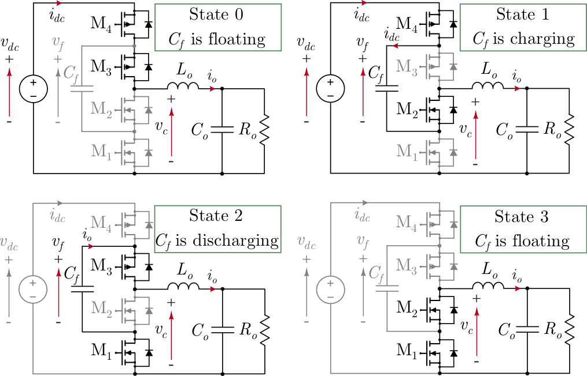

# IEEE SSCE Open-Source Ecosystem "Code-a-Chip": 3 Level Flying Cap Converter

Our project focuses on designing and implementing a DC-DC buck converter demonstrator based on the three-level flying capacitor converter (3L-FCC) architecture, a simple but versatile type of flyingcapacitor multi-level (FCML) converter, using the Skywater 130nm CMOS technology (SKY130). This notebook shows the main steps of the analog design flow, namely simulation, layout and verification of a single converter core.

This converter core was entirely designed in the context of the 2022 SSCS "PICO" Open-Source Chipathon contest. More information can be found at https://platform.efabless.com/projects/881.

## Block diagram

 

  

## To run this Jupyter notebook

To install the Micromamba environment with all the dependencies, run the following commands:
chmod +x init.sh
chmod +x scripts/download_micromamba.sh
chmod +x scripts/micromamba_env.sh
./init.sh

## Team Mebers 

|Name|Affiliation|IEEE Member|SSCS Member|
|:--:|:----------:|:----------:|:----------:|
| Jorge Marín (Team Coordinator, Postdoctoral Fellow)   Email ID: jorge.marinn@usm.cl|AC3E (Chile)| Yes |Yes|
| Christian Rojas (Professor Advisor)   Email ID: c.a.rojas@ieee.org|AC3E, Universidad Técnica Federico Santa María (Chile)| Yes |No|
| Joel Gak (Professor Advisor) |Universidad Católica de Uruguay (Uruguay)| Yes |No|
| Alejandro Oliva (Professor Advisor) |Universidad Nacional del Sur (Argentina)| Yes |No|
| Esteban Lindstrom (Advisor) |Allegro MicroSystems (Argentina)| Yes |No|
| Nicolás Calarco (Postdoctoral Fellow) |Universidad Católica de Uruguay (Uruguay)| Yes |No|
| Alfonso Cortés (Master Student) |AC3E, Universidad Técnica Federico Santa María (Chile)| Yes |No|
| Aquiles Viza (Undergraduate Student) |AC3E, Universidad Técnica Federico Santa María (Chile)| No |No|
| Kevin Pizarro (Master Student) |Universidad Técnica Federico Santa María (Chile)| No |No|
| Sebastián Neira (Graduate Student) |AC3E, Universidad Técnica Federico Santa María (Chile)| No |No|
| Vicente Osorio (Undergraduate Student) |Universidad Técnica Federico Santa María (Chile)| No |No|
| Tomás Velásquez(Undergraduate Student) |Universidad Técnica Federico Santa María (Chile)| No |No|
| Max Vega (Undergraduate Student) |Universidad Técnica Federico Santa María (Chile)| No |No|
| Julio Contreras (Undergraduate Student) |Universidad Técnica Federico Santa María (Chile)| No |No|
| Diego Almonacid (Undergraduate Student) |Universidad Técnica Federico Santa María (Chile)| No |No|
| Carolina Beckmann (Master Student) |Universidad Técnica Federico Santa María (Chile)| Yes |No|
| Pablo Vera (Undergraduate Student) |Universidad Técnica Federico Santa María (Chile)| No |No|
