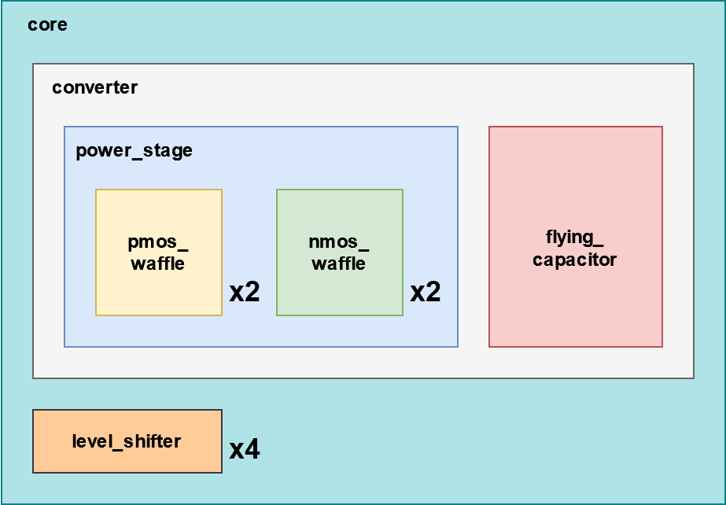

# IEEE SSCS Open-Source Ecosystem "Code-a-Chip": 3 Level Flying Cap Converter

Our project focuses on designing and implementing a DC-DC buck converter demonstrator based on the three-level flying capacitor converter (3L-FCC) architecture, a simple but versatile type of flyingcapacitor multi-level (FCML) converter, using the Skywater 130nm CMOS technology (SKY130). This notebook shows the main steps of the analog design flow, namely simulation, layout and verification of a single converter core.

This converter core was originally designed in the context of the 2022 SSCS "PICO" Open-Source Chipathon contest. More information can be found at https://platform.efabless.com/projects/881. For this contest, the layout generation of the power devices was improved in order to further parametrize the design.

## Block diagram

 

  

## To run this Jupyter notebook

We recomend to open the notebook on https://colab.research.google.com

## Team Mebers 

|Name|Affiliation|IEEE Member|SSCS Member|
|:--:|:----------:|:----------:|:----------:|
| Jorge Marín (Team Coordinator, Postdoctoral Fellow)   Email ID: jorge.marinn@usm.cl|AC3E (Chile)| Yes |Yes|
| Christian Rojas (Professor Advisor)   Email ID: c.a.rojas@ieee.org|AC3E, Universidad Técnica Federico Santa María (Chile)| Yes |No|
| Alfonso Cortés (Master Student) |AC3E, Universidad Técnica Federico Santa María (Chile)| Yes |No|
| Vicente Osorio (Undergraduate Student) |Universidad Técnica Federico Santa María (Chile)| No |No|
| Ítalo Muñoz (Undergraduate Student) |Universidad Técnica Federico Santa María (Chile)| No |No|
