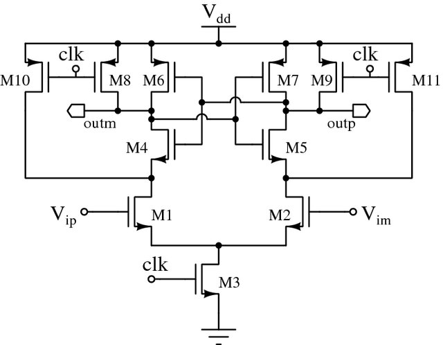
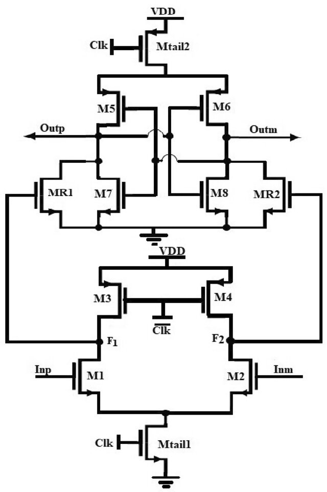

# OpenComp_FoM

Mahprez Team submission for IEEE SSCS TC-OSE Code-a-Chip (VLSI 2026)

## Team

| No. | Name | Role | Email |
|---|---|---|---|
| 1 | William Anthony | Team Lead | willomooi@gmail.com |
| 2 | Benedictus Kenneth Setiadi | Team Member | bkentsetiadi@gmail.com |

## Project Summary

OpenComp_FoM is a reproducible notebook-driven design exploration for dynamic comparators in SKY130.
It compares two topologies:

- StrongARM latch comparator
- Double-tail dynamic comparator

The notebook evaluates tradeoffs among delay, decision energy, and input-referred noise, then ranks design points using PVT and Monte Carlo robustness.

## 1. Functionality and Target Specifications

This project targets early-stage comparator architecture and sizing selection for mixed-signal front-ends (for example, SAR ADC or sensing interfaces). The goal is not only to find one optimal point, but to map the design space and provide a reusable spec-to-sizing method.

### Table 1. Target Specification (Notebook Baseline)

| Parameter | Target | Notes |
|---|---:|---|
| Topologies compared | 2 | StrongARM and Double-Tail |
| Process corner set | 3 corners | TT, SS, FF |
| Supply range in sweep | 1.62 V to 1.98 V | Included in PVT corners |
| Delay target | < 120 ps | Notebook baseline target |
| Energy target | < 12 fJ per decision | Notebook baseline target |
| Input-referred noise target | < 2.0 mV sigma | Notebook baseline target |
| Monte Carlo samples | 80 per shortlisted point | Can be increased |

## 2. Unified Scoring and FoM

Each candidate is scored with normalized metrics so lower is better:

$$
S = w_1 \cdot t_{delay,norm} + w_2 \cdot E_{norm} + w_3 \cdot \sigma_{V_{in,eq},norm}
$$

Default weights in the notebook:

- $w_1 = 0.40$ (delay)
- $w_2 = 0.35$ (energy)
- $w_3 = 0.25$ (noise)

The flow also reports Pareto fronts to avoid over-trusting a single scalar score.

## 3. Example Circuit

### A. StrongARM Latch Comparator (Reference Topology)

The StrongARM topology is used as one of the reference dynamic comparator architectures in this notebook. During reset, internal nodes are precharged; during evaluation, tail current and regenerative positive feedback amplify the differential input and resolve a digital-level decision.



### B. Double-Tail Dynamic Comparator (Reference Topology)

The double-tail architecture separates input and latch stages, which can improve operation at lower supply and reduce kickback/noise tradeoffs depending on sizing and loading.



## 4. Notebook Workflow

1. Environment setup (Colab-compatible tool bootstrap)
2. Parameterized design space generation
3. PVT sweep for both topologies
4. Monte Carlo robustness analysis on shortlisted candidates
5. Unified-score ranking + Pareto extraction
6. Educational regeneration dynamics animation
7. Spec-to-sizing recommendation
8. Artifact export for reproducibility

## 5. How to Run

### Quick Start

1. Open OpenComp_FoM.ipynb.
2. Run all cells from top to bottom.
3. Keep DEMO_MODE = True for a fully reproducible run without external SPICE models.
4. Check artifacts outputs after run completion.

### Recommended Tool Versions

- Python 3.10+ (tested with 3.11)
- Jupyter Notebook 7.x or Google Colab runtime
- ngspice 39+ (only needed when `DEMO_MODE = False`)
- Python packages: numpy, pandas, matplotlib, seaborn, tqdm, pillow

### Python Dependencies

```bash
pip install numpy pandas matplotlib seaborn tqdm pillow
```

### Optional Real-SPICE Mode

To switch from surrogate metrics to transistor-level runs:

1. Install ngspice and ensure it is visible in PATH.
2. Set DEMO_MODE = False.
3. Update generate_netlist(...) with validated model includes and instantiated comparator subcircuits.
4. Update parse_measure_output(...) according to your .measure formatting.

## 6. Generated Artifacts

After execution, the notebook exports:

- artifacts/sweep_pvt.csv
- artifacts/sweep_mc.csv
- artifacts/ranking.csv
- artifacts/pareto.csv
- artifacts/summary.json
- artifacts/plots/pareto_fronts.png
- artifacts/plots/regeneration_dynamics.gif

## 7. Reproducibility Checklist

- Restart kernel and Run All completes without manual edits.
- PVT corner definitions and MC run count are fixed in one config cell.
- Random seed is fixed for deterministic surrogate flow.
- All reported plots and tables are generated from script cells, not manual edits.

## 8. License

This project is released under Apache License 2.0. See the `LICENSE` file in this folder.

## 9. References (Journal and Design Background)

1. B. Razavi, Design of Analog CMOS Integrated Circuits, McGraw-Hill, 2001.
2. P. E. Allen and D. R. Holberg, CMOS Analog Circuit Design, Oxford University Press, 3rd ed.
3. B. Goll and H. Zimmermann, "A Comparator With Reduced Delay Time in 65-nm CMOS for Supply Voltages Down to 0.65 V," IEEE Transactions on Circuits and Systems II.
4. A. M. Abo and P. R. Gray, "A 1.5-V, 10-bit, 14.3-MS/s CMOS Pipeline Analog-to-Digital Converter," IEEE Journal of Solid-State Circuits.
